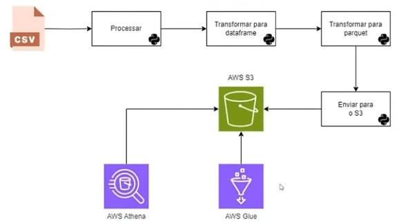

- The python script transform a CSV file into a parquet and json file, and sends this file to your AWS S3 bucket. Json file is only to see the difference about the size of the files. Json is bigger.
- In AWS Glue, you need to create a Crawler (on Demand):
    * Give it a name
    * add a data source (s3://doug-sql-athena-parquet/parquet_files/) and select the foler that the python uploaded the parquet. Choose Crawl subfolders;
    * CHoose or create a IAM role
    * Choose or create a database and choose (onDemand)
    * Run the crawler
- In AWS Athena, try to query results from the created database or from the Parquet file. 